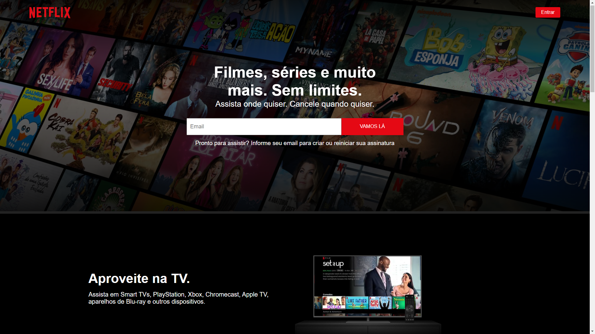

## Olá 👋;

✅ Esse Projeto foi realizado em Front End. com HTML, CSS e Java Script no curso Stackx;

✅ Projeto esse do Netflix, agradecendo a dedicação do professor Edu e da Professora Ghalba;

 

 

#  

### [Clique aqui para acessar o Projeto](https://rafarz76dev.github.io/CloneFrontEndNetflix/)

 
***
  
  

### 🚀 Passo a Passo:

1️⃣ Criar o index.html, já acrescentando as imagens e vídeos;

2️⃣ Criar o style.css;

3️⃣ Criar o JavaScript;

↪😀👀 Bora lá....

↪ Gostou, então já deixa a 🌟

